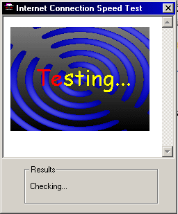

## Test Your Internet Connection Speed\!

### Description

This cool program finds the speed of your modem. It pretty basic. It loads an animated GIF into a browser control and, using the time it took, it calculates the speed! The javascript version is at: http://www.planet-source-code.com/xq/ASP/txtCodeId.2097/lngWId.2/qx/vb/scripts/ShowCode.htm
 
### More Info
 

             |
---                |---
**Submitted On**   |2001-02-09 17:36:34
**By**             |[Wåzerface](https://github.com/Planet-Source-Code/PSCIndex/blob/master/ByAuthor/w-zerface.md)
**Level**          |Intermediate
**User Rating**    |4.0 (8 globes from 2 users)
**Compatibility**  |VB 4\.0 \(32\-bit\), VB 5\.0, VB 6\.0
**Category**       |[Complete Applications](https://github.com/Planet-Source-Code/PSCIndex/blob/master/ByCategory/complete-applications__1-27.md)
**World**          |[Visual Basic](https://github.com/Planet-Source-Code/PSCIndex/blob/master/ByWorld/visual-basic.md)
**Archive File**   |[CODE\_UPLOAD14741292001\.zip](https://github.com/Planet-Source-Code/w-zerface-test-your-internet-connection-speed__1-15160/archive/master.zip)

